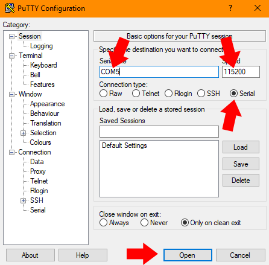

Serial terminal tools
========

## Connecting hardware

Connect development board to computer with Type C cable

Check if the device has been properly identified:

Under Linux can `ls /dev/ttyUSB*` or `ls /dev/ttyACM*` to see, if not you can `ls /dev` come look for the specific device name with the relevant serial chip and drive， and you can use `sudo dmesg` to find device mount message

If Windows, just open Device Manager to view

If the device is not found, you need to confirm if the driver is installed and if the connection is good.


## Using the serial port tool


### Linux

Use `minicom`(recommend) or `screen` etc.

#### minicom

```
sudo apt update
sudo apt install minicom
sudo minicom -s
# Then set the serial port number according to the prompt and the baud rate is 115200. Do not know how to search using the search tool.
# Set Backspace to DEL function
# Set linewrap to Yes
sudo minicom
```

Note that minicom's default configuration file save requires sudo permission, so use `sudo minicom -s`


Press `A` to select device

Press `E` to set the baud rate, the baud rate needs to be set `115200`


Here press `A` and `R` to set the settings the same as screenshot did, the first setting is for `pye`, second for display long line

After setting save and exit, next time do not need to set up is required, just execute `sudo minicom`, if you do not want to use `sudo` every time, execute `sudo usermod -a -G dialout $(whoami)` to add user to the `dialout` user groups, then log off or reboot should be execute in order to take effect, note that if change the configuration by `sudo minicom -s`, the `sudo` is still needed

After entering `minicom`, click the Enter button or the `reset` button of dev board to see the interactive interface of MaixPy.


Input `help()`, you can view help

To exit `minicom`, press `Ctrl+A` `X`, press `Enter` confirm to exit

> Furthermore, you can sepecify device by `-D` parameter, e.g. ` minicom -D /dev/ttyUSB1 -b 115200`


### Windows

Use tools like [putty](https://www.putty.org/) or [xshell](https://xshell.en.softonic.com/)

Then select the serial port mode, then set the serial port and baud rate to open the serial port.



Then click the Enter button to see the interactive interface of MaixPy.

`>>>`

Input `help()`, you can view help

> picture from [laurentopia's tutorial](https://github.com/laurentopia/Learning-AI/wiki/MaixPy)


