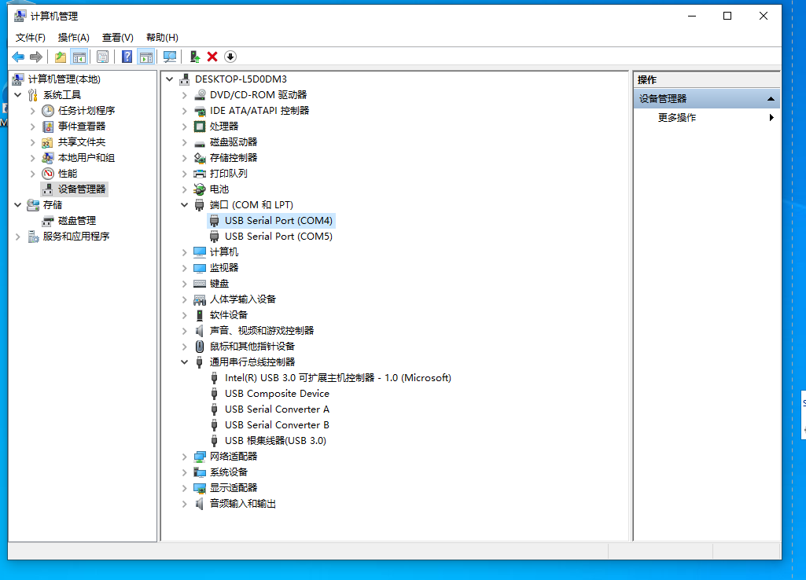

安装驱动
=====

正式使用 MaixPy 之前我们需要先安装好串口驱动，才可进行下一步的开发与使用；因为板子是通过 USB 转串口设备与电脑连接（K210 没有 USB 硬件支持功能）。
根据板子的 USB 转串口芯片型号装驱动。

> 在 `Linux` 或者 `Mac` 下操作串口， 如果不想每次都使用 `sudo` 命令， 执行 `sudo usermod -a -G dialout $(whoami)` 将自己添加到 `dialout` 用户组即可，可能需要注销或者重启才能生效

- 现有开发板板载的 USB 转串口 IC 说明

| 开发板型号 | USB 转 Serail IC | 说明 |
| --- | --- | --- |
|Maix Go    | STM32 | STM32 USB 模拟 FT2232 |
|Maix Dock  | CH340 | |
|Maix Duino | CH552 | |
|Maix Bit | CH552(新版)/CH340(旧版)| CH552 模拟 FT2232 |
|Maix Cube | GD32(新版)/CH552(旧版)| CH552 模拟 FT2232 |
|Maix Amigo | GD32| |GD32 模拟 FT2232 |

### 对于 `Dan Dock` 和 `Maix Bit`（旧版）

开发板使用了 `CH340` ：

Linux 不需要装驱动，系统自带了，使用 `ls /dev/ttyUSB*` 即可看到设备号
Windows 在网上搜索 `CH340 驱动` 下载安装即可，然后可以在 `设备管理器` 中看到串口设备

### 对于 `Maix Go`

开发板使用了一颗 `STM32` 来实现模拟串口以及 `JTAG` 功能， `Windows` 需要安装 `FT2232` 的驱动，请自行搜索 `FT2232 驱动` 下载安装

这款 `STM32` 芯片的固件出厂默认采用 [open-ec](https://github.com/sipeed/open-ec) 的固件， 如果没问题，则会出现一个或者两个串口， 比如 `Linux` 下出现两个串口 `/dev/ttyUSB0` 和 `/dev/ttyUSB1`， 下载和访问串口时请使用 `/dev/ttyUSB1`。 Windows 也类似。

如果需要重新烧录这个固件，可以从 [github](https://github.com/sipeed/open-ec/releases) 或者 [官网下载 open-ec 固件](http://dl.sipeed.com/MAIX/tools/flash-zero.bin)， 然后使用 `ST-LINK` 连接板子上引出的 `STM32` 的 `SW` 引脚（`GND`, `SWDIO`, `SWCLK`）进行烧录。（目前版本的 `Go` 板子上的 `STM32` 不支持串口烧录，只能使用 `ST-LINK` 进行烧录， 有需要请自行购买，或者使用一款板子用 `IO` 模拟也可以（比如树莓派） ）

除了 `open-ec` 还有 `CMSIS-DAP` 固件， 相比 `open-ec` 可以模拟 `JTAG` 来对板子进行调试， `open-ec` 目前还未支持模拟 `JTAG`， 可以 [从官网下载固件](http://dl.sipeed.com/MAIX/tools/cmsis-dap/)， 使用 `ST-LINK` 对其进行烧录， 在 `Linux` 下会出现 `/dev/ttyACM0` 设备

> ST-LINK 对 `STM32` 的烧录方法资料很全，请自行搜索

**请注意对 STM32 更新固件和更新 MaixPy 固件是不一样的， 一般情况不需要更新 STM32的固件， 默认的即够用了， STM32 只是一个 USB转串口的工具而已！！！勿混淆。。。**

### 对于 `Maixduino` 开发板 和 `Maix Bit` 新版带麦克风版本（使用`CH552`） 开发板

开发板使用了 `CH552` 芯片来实现 `USB` 转串口功能，没有 `JTAG` 模拟功能， 
`Windows` 需要安装 `FT2232` 的驱动，请自行搜索 `FT2232 驱动` 下载安装

##  安装驱动

- USB 驱动: **FT2232** ->[[下载链接点这里](https://dl.sipeed.com/MAIX/tools/ftdi_vcp_driver)](https://dl.sipeed.com/MAIX/tools/ftdi_vcp_driver)

我们在拿到 MaixPy 开发板并连接到电脑的时候, 可以打开设备管理器查看串口驱动是否已经安装,打开设备管理器的方法有:
- 此电脑(右键) -> 属性 -> 设备管理器
- 开始菜单(右键) -> 设备管理器
- 控制面板 -> (搜索)设备管理器

  

1. 当我们的系统是 Win10 系统,系统则会帮我们自动安装驱动,而如果是旧版 Win7, win8 系统我们就需要自己手动安装:
    

2. 打开上一节的的链接下载驱动
    
3. 点击安装
    
4. 安装完成之后,可以在设备管理器看到已经识别到两个串口设备了(其中只有一个串口可用)
    
